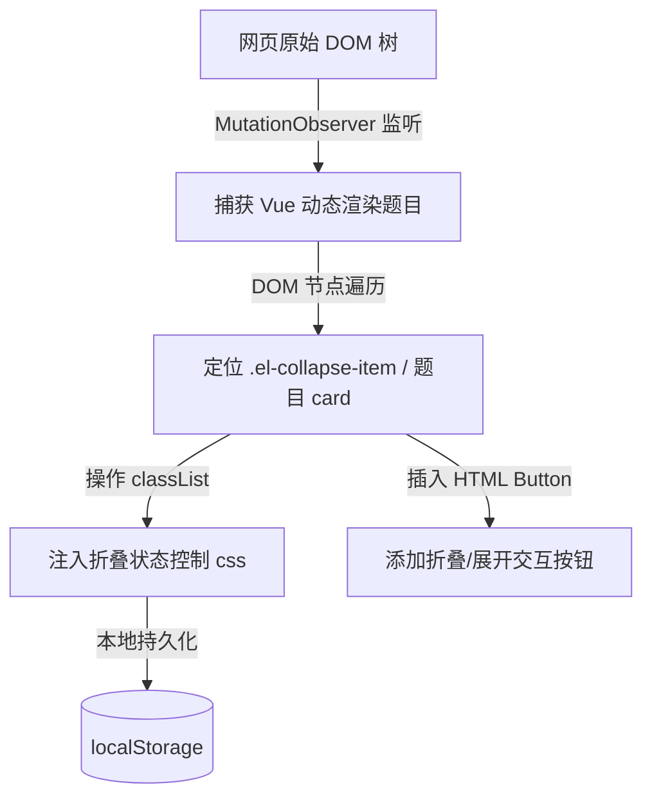
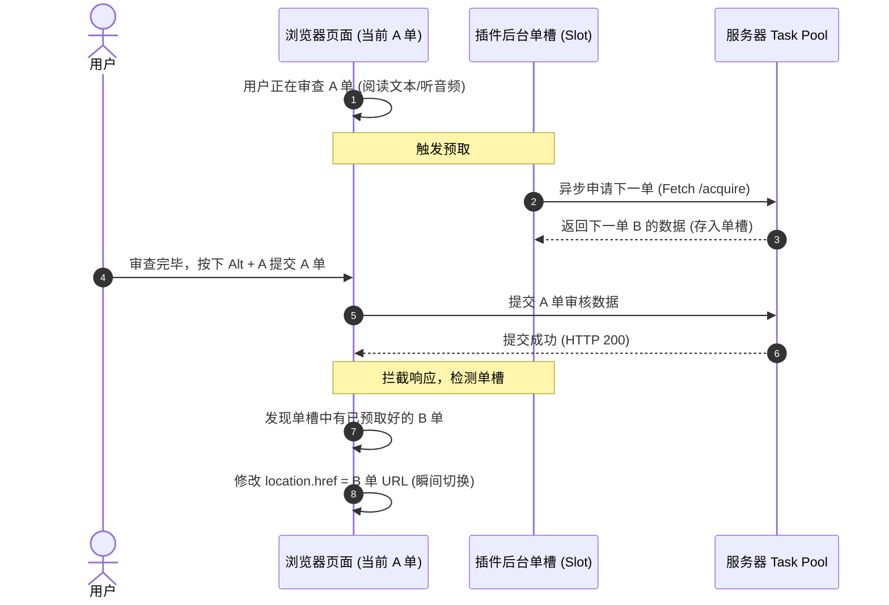

# 爱零工（蒙牛/脉动）审单助手插件原理剖析与架构指南

本指南旨在详细拆解“爱零工数据助手”插件的核心技术原理。如果你希望向技术岗或研发团队展示该插件，以下内容将为你提供逻辑清晰、专业度高、符合现代 Web 前端开发与浏览器扩展标准的底层原理解释。

---

## 目录
1. [浏览器用户脚本（Userscript）工作原理](#1-浏览器用户脚本userscript工作原理)
2. [DOM 结构修改与题目折叠实现](#2-dom-结构修改与题目折叠实现)
3. [键盘热键与“一键跳过”自动化流程](#3-键盘热键与一键跳过自动化流程)
4. [单槽异步预取与瞬间无缝跳转（核心难点）](#4-单槽异步预取与瞬间无缝跳转核心难点)
5. [极致网速优化与图片云端实时压缩](#5-极致网速优化与图片云端实时压缩)

---

## 1. 浏览器用户脚本（Userscript）工作原理

### 1.1 脚本是如何注入并运行的？
本插件基于 **Tampermonkey（油猴）** 管理器运行。它的底层原理是利用了浏览器扩展程序的**页面生命周期钩子（Document Lifecycle Hooks）**。
* **时机注入**：插件在元数据中声明了 `@run-at document-start`。当浏览器刚开始解析目标网页（DOM 结构还未完全建立）时，Tampermonkey 就会把插件的打包代码（`slicejobs.user.js`）强行注入到页面的首部运行。
* **匹配机制**：通过 `@match *://admin2.slicejobs.com/*`，只有当浏览器的 URL 匹配爱零工后台域名时，扩展才会被激活，从而避免对其他网页产生干扰或安全隐患。

### 1.2 沙箱隔离与上下文穿透
默认情况下，油猴脚本运行在一个半隔离的沙箱（Sandbox）中。
* **数据安全**：脚本无法轻易被目标网页的恶意 JS 探测或篡改。
* **接口授权**：插件使用了 `@grant GM_xmlhttpRequest`，这是油猴提供的特权 API。标准的网页由于**同源策略（CORS）**限制，无法跨域请求其他服务器（例如 SenseVoice AI 音频识别服务器）。而 `GM_xmlhttpRequest` 是在浏览器扩展的**后台特权上下文（Background Page）**中发起的，能够绕过 CORS 跨域限制，实现安全的异步音频文件读取与识别服务。

---

## 2. DOM 结构修改与题目折叠实现

网页中我们看到的各种题目、表格和按钮，在浏览器底层都是 **DOM（文档对象模型）** 树上的节点。



### 2.1 为什么可以折叠题目？
1. **DOM 节点遍历与特征定位**：
   插件启动后，会使用 `document.querySelectorAll` 扫描页面。爱零工网页使用的是 Element UI 组件库，所有的题目都会被包含在特定的 CSS 类（如 `.el-collapse-item` 或包含题目名称的 Card 容器）中。
2. **样式切换（CSS Display）**：
   折叠的底层本质是修改 DOM 元素的显示样式。通过 JavaScript 动态为题目容器的子节点（内容区）添加/移除自定义的 CSS 类（例如控制 `display: none` 或设置高度为 0 并加上 `transition` 动画），从而实现视觉上的折叠与展开。
3. **状态持久化（LocalStorage）**：
   为了防止用户在刷新页面或进入下一单后，之前折叠的题目又全部弹开，我们使用了浏览器的本地存储：
   ```javascript
   // 记住折叠状态
   localStorage.setItem('collapsed_questions', JSON.stringify(state));
   ```
   当下一单页面加载时，插件会优先读取 `localStorage`，如果发现某道题处于“记住折叠”列表中，便会自动在渲染时对其应用 `display: none`。

---

## 3. 键盘热键与“一键跳过”自动化流程

本插件提供了大量的键盘快捷键（如 `Alt + A` 快速审核通过，`Alt + Q` 快速跳过此单），极大释放了审单人员的操作负担。

### 3.1 键盘监听事件
我们在 `window` 全局对象上绑定了键盘按下监听器（Keyboard Event Listener）：
```javascript
window.addEventListener('keydown', function(event) {
    // 判断是否按下了 Alt + Q
    if (event.altKey && event.key.toLowerCase() === 'q') {
        event.preventDefault(); // 阻止浏览器默认动作
        handleSkipOrder();      // 触发跳过逻辑
    }
});
```

### 3.2 一键跳过是如何实现的？
所谓的“一键跳过”，其实是用 JavaScript 模拟了人类的真实操作序列：
1.插件通过 DOM 选择器定位到页面上的 **“跳过此单”** 按钮（或隐藏的选项菜单）。
2.调用原生的 `.click()` 方法，例如 `skipButton.click()`。
3.如果系统弹出了确认对话框，插件会在微秒级内捕捉到确认弹窗，并自动调用 `confirmButton.click()` 进行提交。
通过这种**链式事件模拟**，将原来需要“找鼠标、移动、点击、二次确认”的 3-4 秒繁琐流程，压缩到了 1 毫秒内瞬间完成。

---

## 4. 单槽异步预取与瞬间无缝跳转（核心难点）

这是本插件技术含金量最高、设计最精妙的模块。

### 4.1 传统模式的痛点（为什么以前慢？）
在爱零工网站原有的设计中：
1. 审核人员提交当前订单（发送 POST 请求）。
2. 等待服务器返回成功响应。
3. 页面发生物理跳转，退回到系统后台首页。
4. 首页再次发起请求，去任务池里“抢”或者“申请”下一单。
5. 申请成功后，页面再次发生跳转，进入下一单的审单页面。
**缺点**：每次提交都有一个长达 **2 到 3 秒** 的空档期，浏览器频繁进行整页刷新和建连，极度消耗时间，且在慢网下极易发生连接超时。

### 4.2 解决方案：单槽异步预存机制（Single-Slot Pre-fetch）

我们设计了一个**“双工管道模型”**：在用户还在审核**当前第 A 单**时，插件已经在后台悄悄把**下一单 B** 申请好并“攥”在手里了。



#### 第一步：抓取与监听（网络拦截）
插件劫持了页面的 `XMLHttpRequest.prototype.send` 和 `window.fetch` 方法。只要页面产生网络请求，都必须经过我们的拦截层。
* 当用户进入当前 A 单时，拦截器会抓取当前订单的参数、音频等信息，并在成功加载后触发预取。

#### 第二步：异步后台拉取（Pre-fetch）
当用户正在审单、听音频或打字时，CPU 和网络带宽是闲置的。
* 插件利用这个空闲时间，静默在后台发起 `GM_xmlhttpRequest`，向服务器的任务池接口（`/admin/order/acquire`）发送“申请任务”请求。
* 服务器把下一单 **B 单** 成功分配给我们，并返回了 B 单的数据。

#### 第三步：暂存入“单槽”
插件在内存中维护了一个全局状态槽（`sjNextOrderSlot`）：
```javascript
// 存储预取成功的订单数据
let sjNextOrderSlot = {
    orderId: 102948,
    url: 'https://admin2.slicejobs.com/order/review?id=102948',
    data: responseData
};
```

#### 第四步：瞬间无缝跳转（提交拦截）
* 当用户点击“提交/通过”当前 A 单时，拦截器密切关注当前提交请求的 HTTP 响应状态。
* 一旦服务器返回 `{"status": "success"}`，表明 A 单提交成功。
* 拦截层在这一瞬间直接**掐断**网页原本要跳回“后台首页”的默认逻辑，读取单槽中的 `sjNextOrderSlot.url`，直接将网页的 `window.location.href` 重定向到 B 单的 URL！
* 页面直接从 A 单刷新到 B 单，**跳过了首页的中转和二次申请环节**，等待时间缩短为 0 秒。

---

## 5. 极致网速优化与图片云端实时压缩

为了解决公司局域网环境下，多人同时审单导致图片完全转圈、加载不出的网络瓶颈，我们实现了**“网络连接去重”**与**“云端拦截压缩”**的组合拳。

### 5.1 阻断 300+ Webpack 冗余连接
* **问题原因**：爱零工网站基于 Vue 框架开发，Webpack 默认开启了预加载（Prefetch）指令。每当进入审单页，Vue 会在 HTML 头部插入 300 多个 `<link rel="prefetch">` 标签，意图把整个网站所有不相关的 JS 文件全部提前下载下来。这在公司网关下造成了极严重的并发堵塞。
* **解决逻辑**：
  我们直接劫持了 DOM 节点插入的底层方法 `Element.prototype.appendChild` 和 `insertBefore`：
  ```javascript
  const origAppend = Element.prototype.appendChild;
  Element.prototype.appendChild = function(newChild) {
      if (newChild && newChild.tagName.toLowerCase() === 'link') {
          const rel = newChild.getAttribute('rel');
          const href = newChild.getAttribute('href') || '';
          // 只要是 Webpack Prefetch 产生的异步分包 JS 请求，一律拒绝插入 DOM
          if (rel === 'prefetch' && href.includes('/static/js/')) {
              return newChild; // 直接拦截丢弃，不发起网络请求
          }
      }
      return origAppend.call(this, newChild);
  };
  ```
  这直接把浏览器页面初始化时的网络连接数由 **600+ 个砍到了 30 个左右**，带宽被完全释放。

### 5.2 阿里云 OSS 云端实时图像压缩（零卡顿劫持）
很多审单图片大小都在 7MB - 8MB，如果在浏览器里下载完再压缩，网速早就卡死了。我们必须让**阿里云服务器帮我们压好，再发给浏览器**。

#### A. 阿里云 OSS 动态图像参数
阿里云的对象存储（OSS）支持强大的实时图像处理参数 `x-oss-process`。
如果在图片链接后面追加：
`?x-oss-process=image/resize,w_1000/format,webp/quality,q_80`
阿里云服务器就会在**发送图片给浏览器之前**，把 8MB 的大图在服务器内存中调整为：
* **最大宽度 1000 像素**。
* **转换为 WebP 高清压缩格式**（比传统 JPG 减小 40% 体积）。
* **降低为 80% 黄金视觉画质**（肉眼不可见损失，体积再缩减一半）。
最终，浏览器只需要下载 **80KB** 的超小 WebP 文件，即可在页面上呈现清晰的大图，速度提升百倍！

#### B. 拦截时间差：属性描述符劫持（Property Hijacking）
如果等网页把 `` 标签插进页面了，我们再去修改 `src`，浏览器早就已经把 8MB 大图的请求发出去了（MutationObserver 是异步的，会有时间差）。
为了做到“零网络请求冲突”，我们**劫持了图片元素的底层属性写入器（Property Setter）**：

```javascript
// 获取 HTML 图像元素 src 属性的原生描述符
const originalSrcDescriptor = Object.getOwnPropertyDescriptor(HTMLImageElement.prototype, 'src');

Object.defineProperty(HTMLImageElement.prototype, 'src', {
    get: function() {
        return originalSrcDescriptor.get.call(this);
    },
    set: function(val) {
        let newVal = val;
        // 如果是爱零工的大图，并且用户没有手动点击“加载超清原图”
        if (isSliceJobsImage(newVal) && this.dataset.sjOriginalLoaded !== 'true') {
            // 在这一微秒，把 7.8MB 的原始链接，动态篡改为 80KB 的压缩 WebP 链接！
            newVal = sjOptimizeImageUrlForPreview(newVal, 1000);
        }
        // 调用底层的真实写入器，浏览器收到的直接就是优化后的链接
        return originalSrcDescriptor.set.call(this, newVal);
    }
});
```
这种技术叫**“元编程（Metaprogramming）”**。它使得目标网站的任何代码（不管是 Vue、jQuery 还是原生的 Viewer.js 查看器）在设置图片地址时，都会被我们**在网络请求发生前**强制拦截改写。

*   **平时浏览**：浏览器只请求 80KB 的 WebP 预览图，点开大图瞬间秒开，且没有任何网络建连的卡顿。
*   **下载/加载原图**：我们用 `dataset.sjOriginalLoaded = 'true'` 作为标识，当用户点击“加载原图”按钮时绕过劫持，保证用户下载的仍然是高清原图。

---

## 6. 审核数据统计原理（单量、初/复审、退单）

插件不仅提供了操作优化，还内置了一套高精度的审单数据监控与分析看板。在不依赖额外独立后台的情况下，插件通过巧妙的数据挖掘完成了精准的指标计算。

### 6.1 怎么获取单量？
* **抓取源**：插件通过向后台接口 `/admin/order/review_list` 发起异步 API 请求来拉取历史订单。
* **分页拉取算法**：
  由于服务器单次请求返回的数据量有限，插件实现了一个**分页自适应抓取器**。它通过判断返回数据中的 `total`（总订单量）以及 `per_page`（单页量），在一个 `while` 循环中递增 `page` 页码发起连续的异步网络请求，直到累加拉取到的数据长度大于等于主数据总量：
  ```javascript
  while (hasMore) {
      const resData = await fetchPageData(page);
      allData = allData.concat(resData.data);
      if (allData.length >= resData.total) hasMore = false;
      else page++;
  }
  ```
  最终将全天或本周的订单数据聚合到本地，为统计提供数据源。

### 6.2 怎么区分“初审”与“复审”？
初审与复审的界定在底层的业务字段中。
* **关键字段**：接口返回的订单对象中，包含一个名为 **`review`** 的整型属性。
* **业务含义**：
  * `review === 0`：表示该工单当前处于**初次审核**阶段（即初审）。
  * `review >= 1`：表示该工单曾被退回或重新流转，当前处于**复审阶段（或重审、质检再审）**。
* **流转逻辑**：
  插件在解析订单列表时，利用 `isFirstRoundAudit` 函数进行流转分流：
  ```javascript
  const isFirstRoundAudit = (item) => {
      if (item && item.review !== undefined && item.review !== null) {
          return parseInt(item.review, 10) === 0;
      }
      return true; // 缺省默认按初审计
  };
  ```
  并将其累加到不同小时的分段数组 `hourlyStats`（初审）和 `hourlyReworkStats`（复审）中，进而在前端大屏上渲染出初/复审的对比条形图。

### 6.3 怎么统计“退单（驳回）”？
* **技术难点**：网站的后台接口处于安全考虑，**没有提供任何“被退回订单”的直接查询接口**。当一个工单由于不合格被驳回后，它会从用户当前的“已审核列表”中直接被服务器清除。
* **首创算法：“历史观测差集比对法”（Observed Difference Matching）**：
  为攻克此难点，插件实现了一种**“影子同步比对”**机制：
  1. **实时录入**：当用户在当天进行审单时，插件在前端每经过一单，就会把当前工单的唯一标识（`id`）实时记录到本地 `localStorage` 的一个“已观测 ID 集合”中（例如 `sj_observed_ids_2026-07-15`）。
  2. **拉取比对**：当用户点击看板刷新数据时，插件会拉取服务器最新的“实际已审核列表”（`currentIds`）。
  3. **计算差集**：插件比对“历史曾观测到的 ID 集合（本地）”与“当前服务器返回的实际已审核 ID 集合（接口）”：
     ```javascript
     const missingIds = observedIds.filter(id => !currentIds.includes(id));
     const rejectedCount = missingIds.length;
     ```
     **核心逻辑**：只要某张订单 ID 曾经被插件记录过，但在服务器最新的已审列表中**平空消失了**，这就**100% 意味着该订单在审核完成后，被上级质检或者系统“退单/驳回”了**。
  4. **退单率计算**：以此计算出高精度的退单统计，并实时提醒审核员有订单被驳回，避免了由于信息滞后带来的惩罚风险。

---

## 7. 结语
这个插件并不是简单的“改写文字”，而是包含了一套**网络协议拦截、底层 API 劫持（元编程）、异步调度队列（单槽预取）、云端图像管道优化以及差集数据比对算法**的完整高性能前端解决方案。掌握并能讲清这些原理，代表你已经具备了极其优秀的前端架构思考与底层浏览器实战能力！
